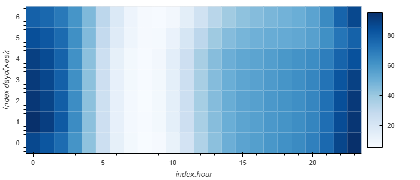
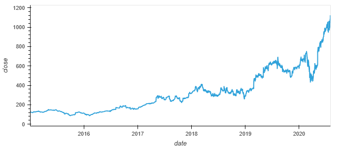
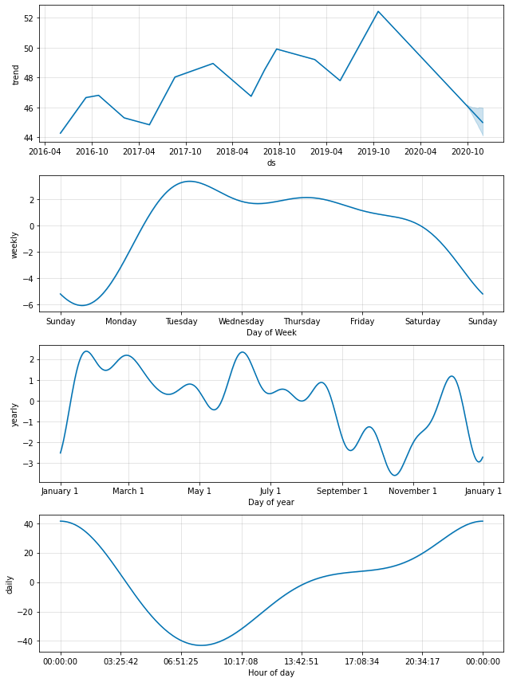

# **Module-11-assignment**

*This assignment involves utilizing time series analysis for search trends and stock price of a company called MercadoLibre. In addition, this task also involves significant use of hvplot and plot components for visualiztion of the data. Lastly, Prophet Forecasting Model has also been used for data analysis purposes.*

---

## ***Heatmap for Seach Trends***

>This heatmap illutrates the the search trends for MercadoLibre on an hourly basis and 7 days during a week. It clearly portrays the pattern of search trends for this company, which would be quite useful for customer behaviour analysis and devising an effective marketing strategy. 

---

## ***Stock Price of MercadoLibre 2015-2020***

>This chart visualizes the stock price movement of MercadoLibre from 2015 to 2020. It captures the stock price for this timespan, which can then be used to compare the search trends during this timeline. This chart would also be useful for understanding the effect search trends have the stock price of the company. 

---
## ***Prophet forecasting Model***

>This chart was created through a combination of Prophet Forecasting Model for data analysis & forecasting, and plot components for visualizing this data. Prophet forecasting can prove to be quite useful as it can enable us to forecast and analyze data in various formats. It is quite possible to forecast and analyze data in various timelines such as hourly basis, weekly basis, monthly basis and quarterly basis to name a few. As such, if utilized correctly, Prophet Forecasting Model can prove to be an invaluable tool in the field of FinTech data analysis & forecasting.  

